## 数据科学家需要具备的知识和技能

- 了解数据的特征

- 数据可视化：R的绘图系统

- 制作并发布报告

## 完整的数据分析流程：

1. 观测
2. 变量
3. 数据矩阵

- 其中的一行数据叫做一次观测，一列叫做一个变量

- 变量的类型：数值（连续，离散），分类变量（无序，有序）

- 变量间的关系

# 数值变量的特征和可视化

- 数据集中趋势的测量：
  均值、中位数、众数

- 数据分散趋势的测量：

值域、方差、标准差、四分位距

```
x <- c(1,2,3,4,5,6,7,8,9) 表示创建一个向量
mean(x) 表示求x的均值
median(x) 表示求方位数
median(x) 表示方差
sd(x) 表示标准差
summary(x) 表示x的总结信息
```

- 稳健统计量
  - 是：中位数、四分位差（受极端值影响小）
  - 否：均值、标准差、值域（受极端值影响大）


## 一个变量的可视化
- 柱状图、点图
- 箱图（中位数、分位点、极端值）
- 两个变量的关系
- 散点图：方向、形状、强度、极端值

# 分类变量的特征和可视化

## 一个分类变量的可视化

- 频率表、条形图
- 关联表、相对频率表
- 分段条形图、相对频率分段条形图
- 马赛克图


## 一个分类变量、一个数值变量的关系

- 并排箱图


# R的三大绘图系统

## 基本绘图系统
- 艺术家的调色板：绘图始于空白帆布
- 需要事先计划：直观地实时反应绘图和分析数据的逻辑
- 两步：图 + 修饰/添加 = 执行一系列函数
- 适于绘制2D的

绘图函数（plot）

```
调用函数会启用一个图形设备（如果没有正在运行的图像设备），并在设备上绘图
基本绘图系统 + 屏幕设备
plot(x,y,...)
重要参数：xlab/ylab/lwd/lty/pch/col
par() 用于设置全局参数（作用于R中所有plot绘图）
这些参数是可以修改的
hist(airquality$Wind) 表示空气质量的风速的变化
hist(airquality$Wind, xlab = '风速') 表示为其添加一个X轴上的label
boxplot(airquality$Wind) 表示为其画一个箱图
boxplot(airquality$Wind, xlab = '风速',ylab = '速度') 表示为一个数值变量添加相关坐标的label
boxplot(Wind~Month,airquality,xlab = '风速',ylab = '速度') 表示画一个并排的箱图
plot(airquality$Wind,airquality$Temp) 表示画出风速和温度的关系
with(airquality,plot(Wind,Temp)) 跟上图的类似
with(airquality,plot(Wind,Temp,title(main='wind and temp'))) 表示在前面的基础上添加一个标题
with(airquality,plot(Wind,Temp,title(main='wind and temp'),type = 'n')) 其中的type = 'n'表示默认不画数据
with(subset(airquality,Month == 9),points(Wind,Temp,col='green')) 表示画出空气9月份的数据，颜色为绿色
with(subset(airquality,Month == 5),points(Wind,Temp,col='red')) 表示画出空气9月份的数据，颜色为红色
with(subset(airquality,Month %in% c(6,7,8)),points(Wind,Temp,col='black')) 表示查看6，7，8月份的数据，颜色为黑色
fit <- lm(Temp ~ Wind,airquality) 表示创建一个回归分析
abline(fit,lwd = 2) 创建一条线
legend('topright',pch = 1,col = c('red','green','black'),legend = c('sep','may','other')) 表示设置相关的参数
```

- 设置参数

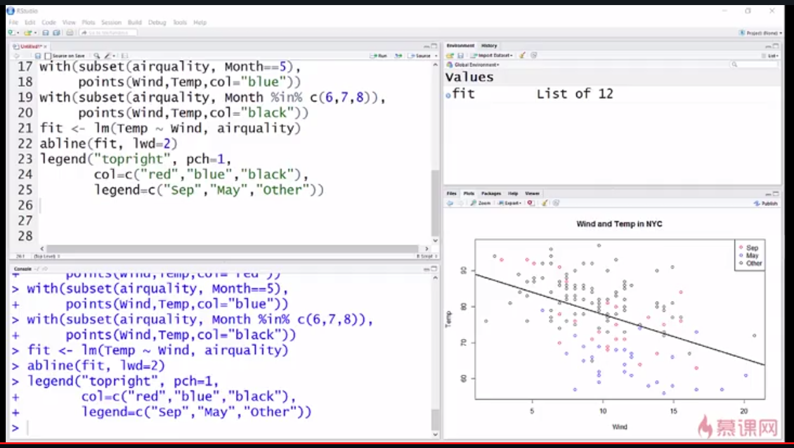

- 散点图

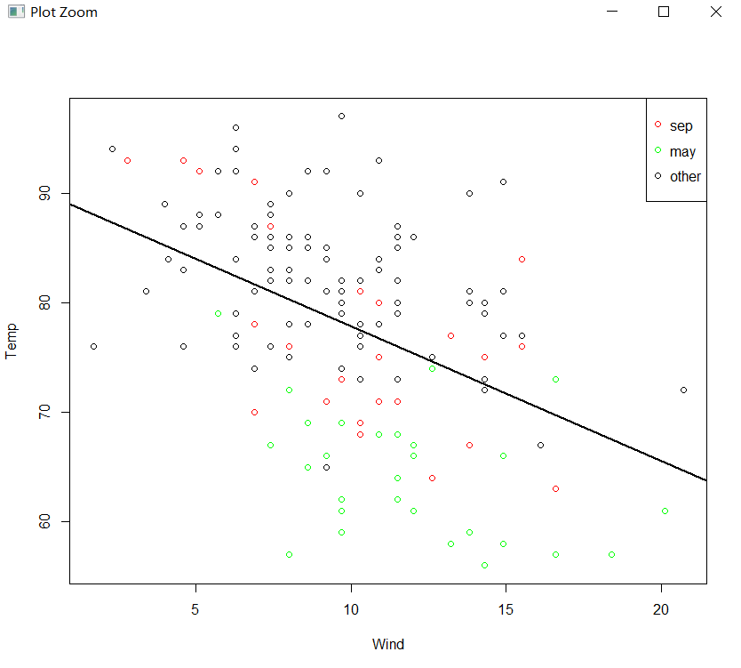

- 全局参数的设置

```
par('bg') 背景颜色，默认为白色
par('col') 点的颜色，默认为黑色
par('mar') #（bottom,left,top,right）
par('mfrow') 默认为一行一列，表示只能放一幅图,按行
par('mfcol') 默认为一行一列，表示只能放一幅图，按列
par(mfrow = c(1,2)) 表示可以画一行两列，可以画两幅图

hist(airquality$Wind)
hist(airquality$Temp) 此时就可以画两幅图
```

## Lattice绘图系统

- 绘图 = 使用一次函数调用（一次成图）
- 特别适用于观测变量间的交互：在变量z的不同水平，变量y如何随变量x变化
- 绘图函数
- lattice包（xyplot）格式：xyplot（y ~ x|f * g,data）
- panel函数，用于控制每个面板内的绘图
- grid包
- 实现了独立base的绘图系统
- lattice包是基于grid创建的，很少直接从grid包调用函数
- lattice于base的重要区别
- base绘图函数直接在图形设备上绘图
- Lattice绘图函数返回trellis类对象
- 打印函数真正执行了在设备上绘图
- 命令执行时，trellis类对象会被自动打印，所以看起来就像是lattice函数直接完成了绘图

```
library(lattice) 导入包
xyplot(Temp ~ Wind, data = airquality) 表示生成一个散点图
airquality$Month <- factor(airquality$Month)表示将airquality$Month这个变量变为分类变量
xyplot(Temp ~ Wind | Month, data = airquality,layout = c(5,1)) 表示5行一列的数据显示
q <- xyplot(Temp ~ Wind, data = airquality) 表示将结果传入q中，并不画图
print(q) 此时就可以画出这个图了
set.seed(1) 设置种子点为1，使用随机变量的时候记得设置种子点
x <- rnorm(100) 表示从服从正态分布的数据中随机取出100个数据来
f <- rep(0:1,each=50) 表示f中有100个数字
y <- x + f - f*x + rnorm(100,sd = 0.5) 设置一个公式，并加入相关的误差
f <- factor(f,labels = c('group1','group2'))让f成为一个分类变量，并设置相应的标签
xyplot(y ~ x | f, layout = c(2,1)) 设置了两个面板
xyplot(y ~ x | f, panel = function(x,y){
  panel.xyplot(x,y)
  panel.abline(v = mean(x),h = mean(y),lty = 2)
  panel.lmline(x,y,col = 'red')
}) 表示自定义面板
```

## gglot2绘图系统

- 图：动词、名词、形容词等
- 数据映射到几何客体的美学属性
- 是基本绘图系统 + Lattice绘图系统的合体
- 自动处理标题/文字说明/空间等，但也允许通过添加注释进行修改
- 层

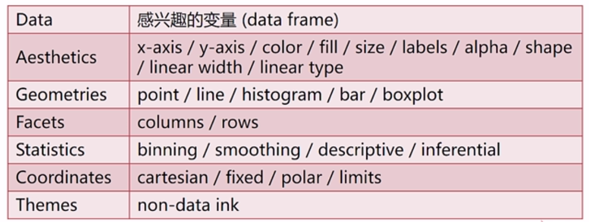

- 绘图函数

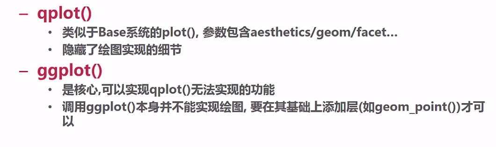

```
library(ggplot2) 导入库ggplot2
```

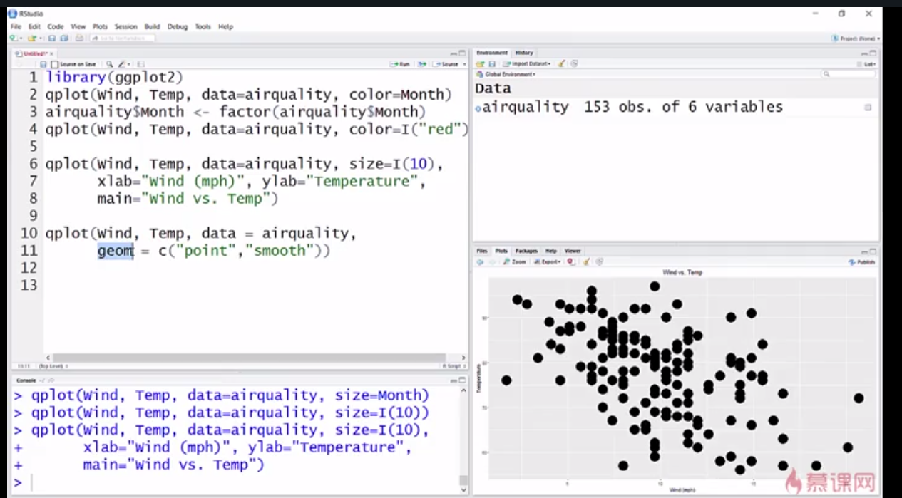

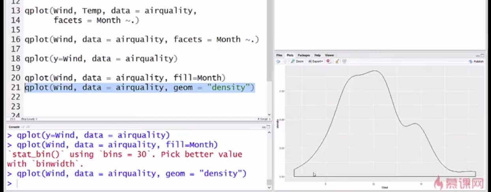

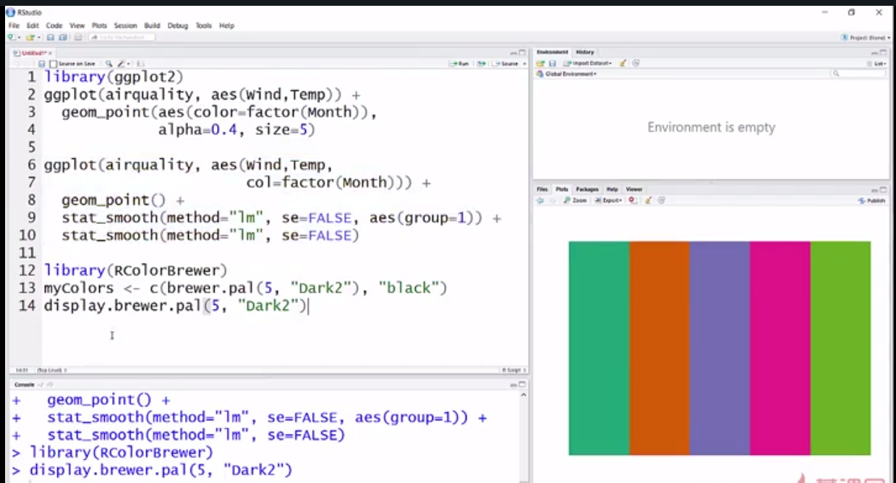

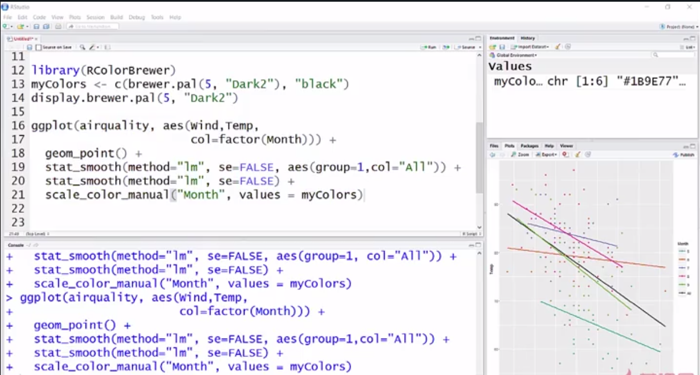

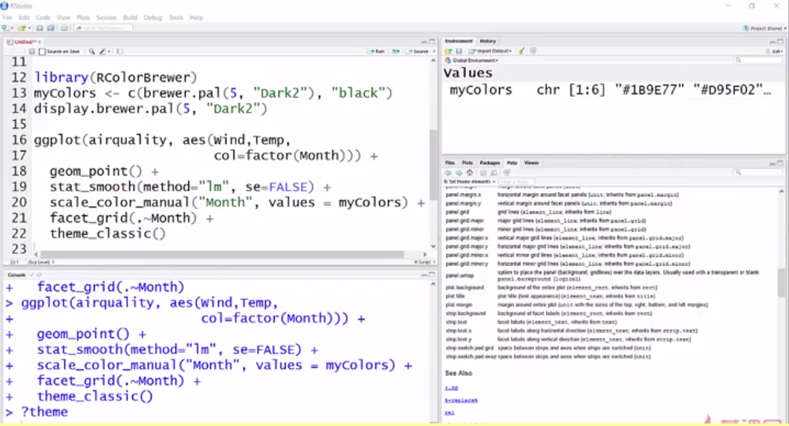

## R语言绘图的颜色

- grDevice包


- RColorBrewer包

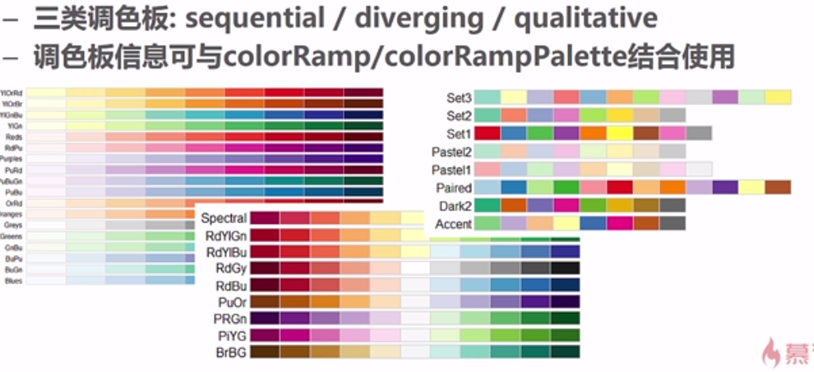

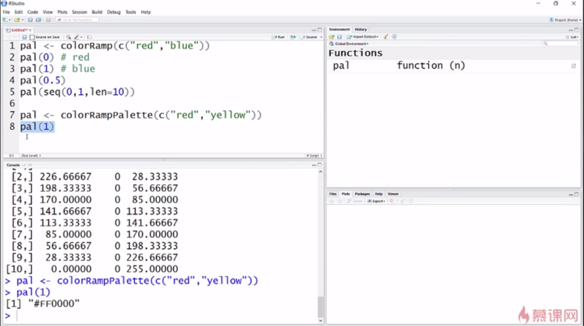

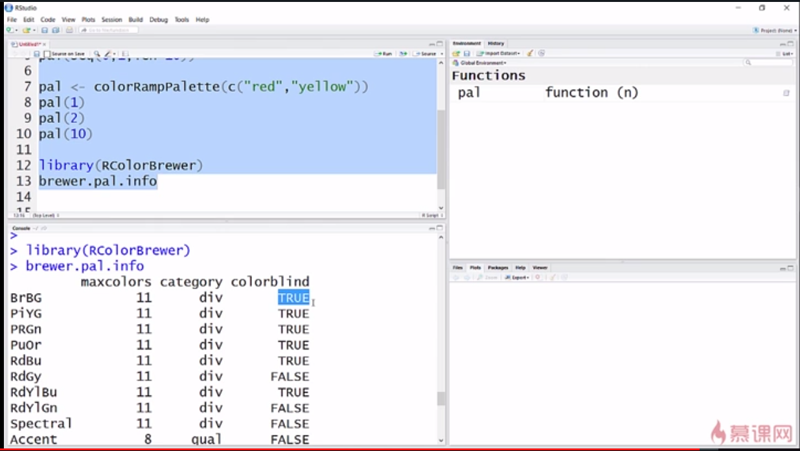

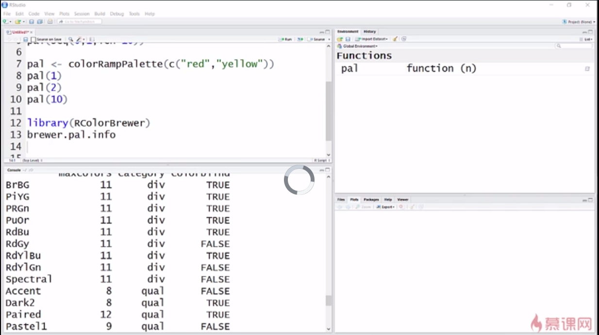

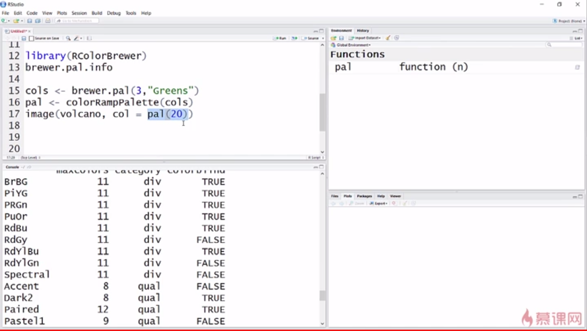

## R支持的图形设备

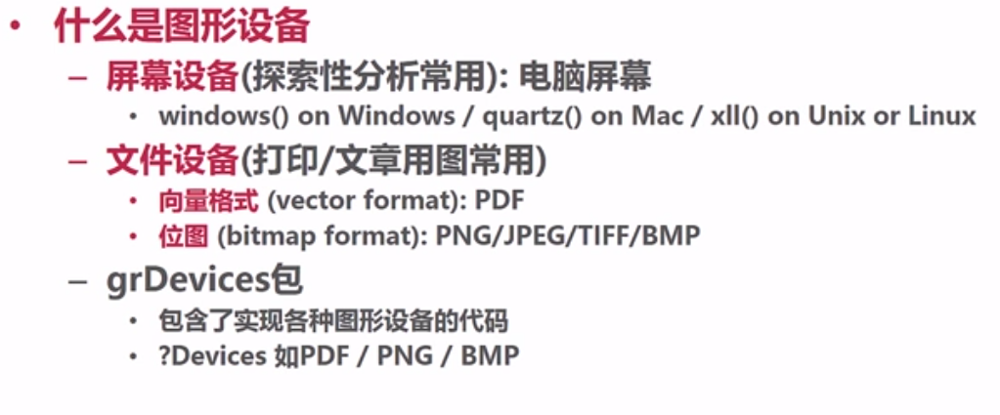

- 生成图形的两种途径


- 拷贝图形


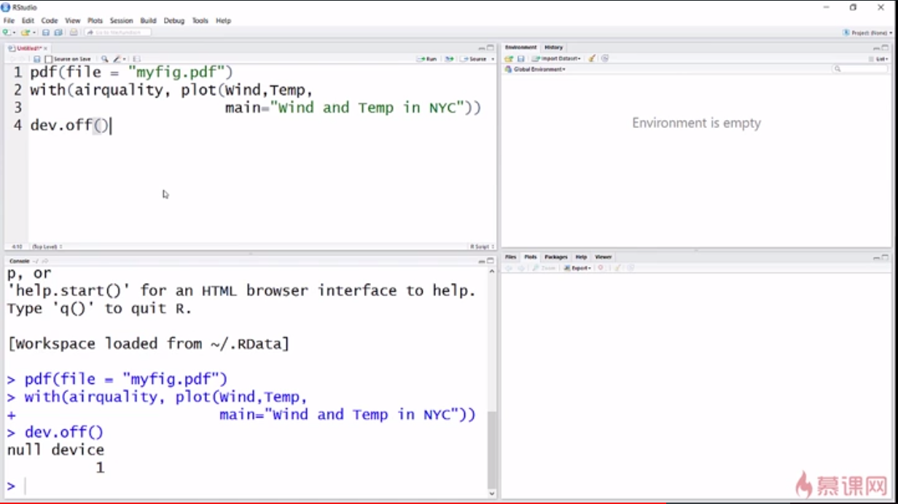

## 绘图前思考

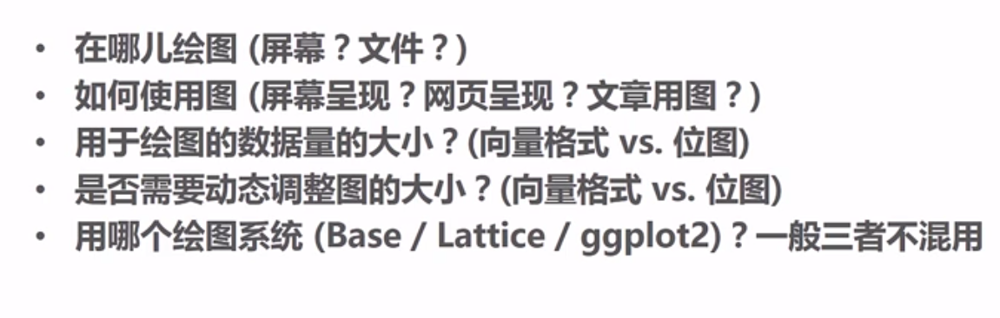

## 探索性数据


